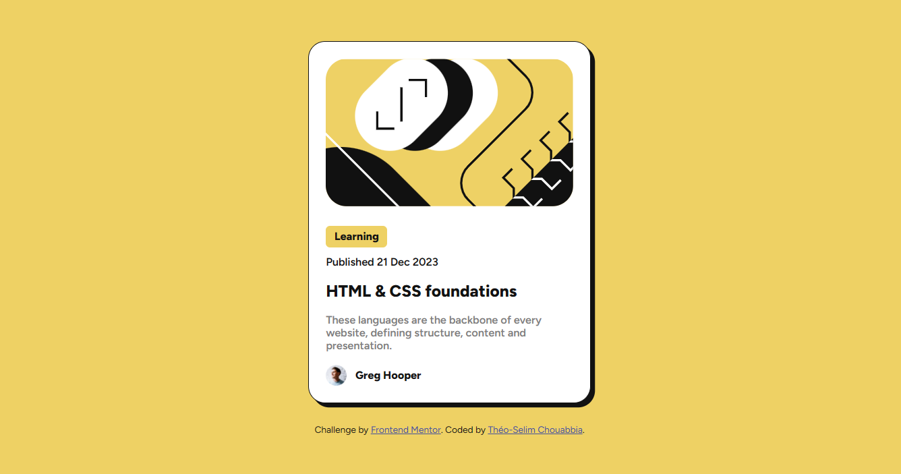

# Frontend Mentor - Blog preview card solution

This is a solution to the [Blog preview card challenge on Frontend Mentor](https://www.frontendmentor.io/challenges/blog-preview-card-ckPaj01IcS). Frontend Mentor challenges help you improve your coding skills by building realistic projects. 

## Table of contents

- [Overview](#overview)
  - [The challenge](#the-challenge)
  - [Screenshot](#screenshot)
- [My process](#my-process)
  - [Built with](#built-with)
  - [What I learned](#what-i-learned)
- [Author](#author)

**Note: Delete this note and update the table of contents based on what sections you keep.**

## Overview

### The challenge

Users should be able to:

- See hover and focus states for all interactive elements on the page

### Screenshot

## My process

[x] Doing HTML structure first.
[x] Write out the base styles for this project, including general content styles, such as `font-family` and `font-size`.
[x] Start adding styles to the top of the page and work down.

### Built with

- Semantic HTML5 markup
- CSS custom properties
- Flexbox
- Mobile-first workflow

### What I learned

This was a great training to realize that simple things like that can take more time than we though. 

## Author

- Website - [Théo-Selim Chouabbia](https://github.com/theooow)
- Frontend Mentor - [@theooow](https://www.frontendmentor.io/profile/theooow)